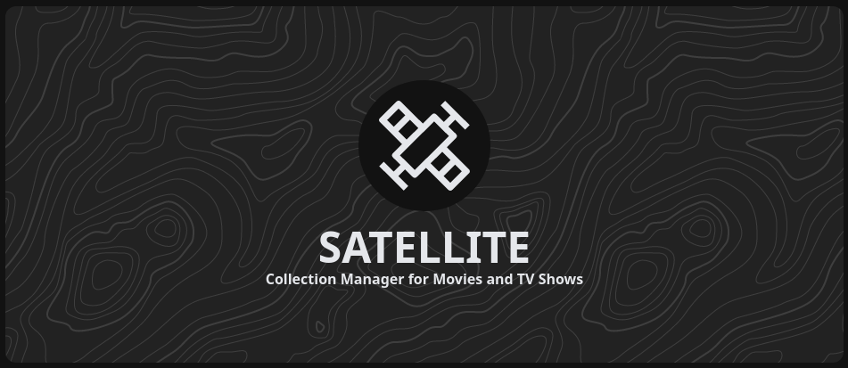

</img>

# Satellite

Collection manager for movies and TV shows that gives Usenet and BitTorrent users better ease of use.

# Features

## Current
- Neat UI
## Future
- Find and manage movies and shows
- Automatically detects and downloads new episodes
- Integrations with NZBGet

## Todo
- [  ] Webhook / Bot
- [  ] Add PWA
- [  ] Add IndexedDB
- [  ] File system to client sync
- [  ] Calendar
- [  ] Activity
- [  ] Initial preferences, to allow for config settings
- [  ] Settings
- [  ] System
- [  ] Downloads
- [  ] Spotify import
- [  ] Listen for streams (twitch, etc)
- [  ] Boolean to allow for self hosted database or Satellite generate database
- [  ] Profile based content selection
- [  ] Ratio based height/width for masonry items